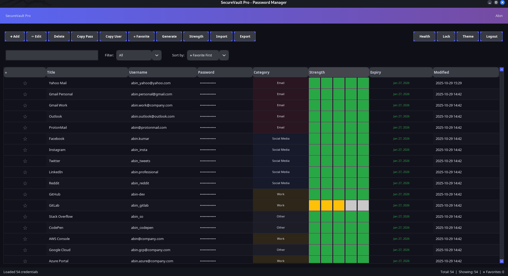
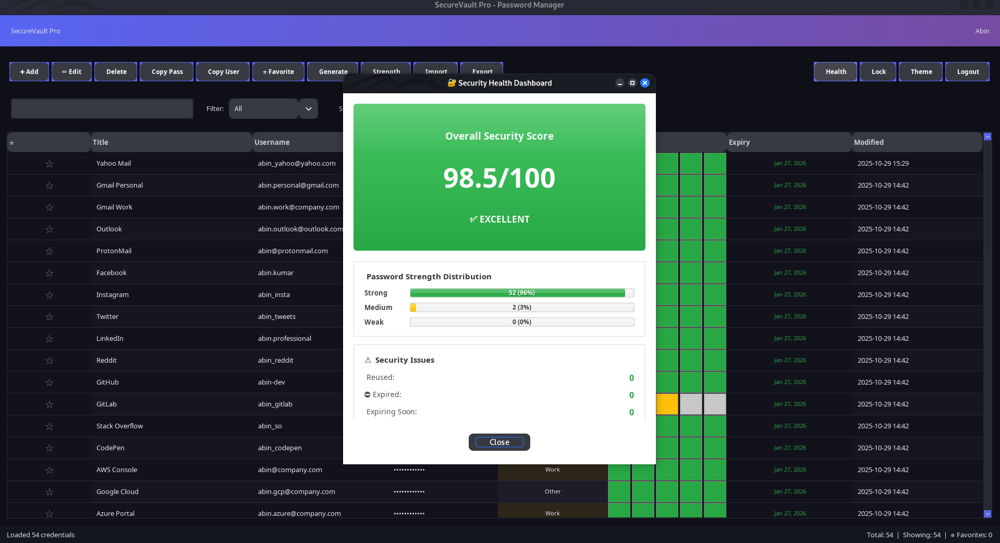
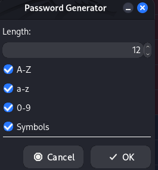

# SecureVault Pro - Password Manager


**Version 3.0** - A beautiful, feature-rich password management application with military-grade security, modern UI, and comprehensive password management features.

---

## Table of Contents

- [Overview](#overview)
- [Features](#features)
- [Screenshots](#screenshots)
- [Quick Start](#quick-start)
- [Installation](#installation)
- [Usage](#usage)
- [Security](#security)
- [Documentation](#documentation)
- [Contributing](#contributing)
- [License](#license)

---

## Overview

**SecureVault Pro** is a secure, open-source desktop password manager built with Java Swing and SQLite. It provides military-grade AES-256 encryption for password storage with a modern, intuitive user interface inspired by contemporary design principles.

### Why SecureVault Pro?

- **100% Offline** - Your data never leaves your computer
- **Open Source** - Transparent security you can audit
- **Zero Dependencies** - No external services or subscriptions required
- **Cross-Platform** - Works on Linux, macOS, and Windows
- **Lightweight** - Fast and resource-efficient

---

## Features

### Security Features

- **AES-256-CBC Encryption** - Military-grade encryption for all passwords
- **PBKDF2 Key Derivation** - 100,000 iterations for secure key generation
- **SHA-256 Authentication** - Salted password hashing for user accounts
- **Session Timeout** - Auto-lock after 5 minutes of inactivity
- **Clipboard Security** - Auto-clear copied passwords after 30 seconds
- **Manual Lock** - Instant vault locking with Ctrl+L

### Password Management

- **Password Generator** - Cryptographically secure random password generation
- **Strength Checker** - Real-time password strength analysis with visual feedback
- **Health Dashboard** - Overall security score and password health metrics
- **Expiry Tracking** - Password expiration dates with visual warnings
- **Reused Password Detection** - Identify and flag reused passwords

### Organization Features

- **Multi-User Support** - Each user has their own encrypted vault
- **Category System** - Organize credentials (Social Media, Banking, Email, Work, etc.)
- **Favorites System** - Mark important credentials with star icons
- **Smart Filters** - Filter by All, Favorites, or password strength (Weak/Medium/Strong)
- **Multiple Sort Options** - Sort by Title, Username, Date, or Favorite status
- **Real-Time Search** - Instant credential filtering as you type
- **Notes Field** - Add detailed notes to any credential

### Additional Features

- **Website URLs** - Store and open associated websites directly from the app
- **Encrypted Attachments** - Securely store files up to 10MB
- **Import/Export** - Backup and restore with encrypted archives
- **Dark/Light Themes** - Beautiful, modern UI with theme switching
- **Keyboard Shortcuts** - Efficient workflow with hotkeys
- **Duplicate Prevention** - Automatic detection of duplicate credentials
- **Timestamps** - Track when credentials were created and modified

---

## Screenshots

### Main Dashboard



*Beautiful, modern interface with all your credentials organized. Features include real-time search, smart filters, category tags, password strength indicators, and favorite markers.*

### Password Health Dashboard



*Monitor your password security with comprehensive analytics. Track weak passwords, reused passwords, expired credentials, and get an overall security score.*

### Password Generator



*Generate cryptographically secure passwords with customizable options. Adjust length, include/exclude character types, and see real-time strength analysis.*

---

## Quick Start

### Prerequisites

- **Java 17 or higher** (OpenJDK or Oracle JDK recommended)
- Linux, macOS, or Windows operating system
- Terminal/Command Prompt access

### Demo Credentials

On first launch, the application automatically creates a demo account with sample data:

- **Username:** test
- **Password:** 12345

The demo account includes 8 sample credentials across different categories to help you explore all features.

### One-Line Launch

```bash
chmod +x run.sh && ./run.sh
```

That's it! The script will automatically:
- Download required dependencies (SQLite JDBC, SLF4J) if missing
- Compile the Java sources if needed
- Launch the application

---

## Installation

### Option 1: Quick Run (Recommended)

**1. Clone the repository:**

```bash
git clone https://github.com/Abin-Shaji-Thomas/SecureVault.git
cd SecureVault
```

**2. Run the application:**

```bash
chmod +x run.sh
./run.sh
```

### Option 2: Manual Compilation

If you prefer to compile manually:

```bash
# Create bin directory
mkdir -p bin

# Compile all sources
javac -Xlint:all -cp "lib/*:." -d bin src/*.java

# Run the application
java -cp "bin:lib/*" SecureVaultSwingEnhanced
```

### Option 3: IDE Import

You can also import this project into your favorite Java IDE:

- **IntelliJ IDEA:** Open as Maven/Gradle project or import from existing sources
- **Eclipse:** Import as Java project and add lib/*.jar files to build path
- **NetBeans:** Open project and configure libraries

For detailed platform-specific instructions, see [INSTALLATION.md](docs/INSTALLATION.md).

---

## Usage

### First Time Setup

1. **Launch the application** using one of the methods above
2. **Login** with demo credentials (test / 12345)
3. **Explore** the 8 pre-loaded demo credentials
4. **Create your own user** by clicking "Create User" in the login dialog

### Adding a Credential

1. Click **Add** button or press `Ctrl+N`
2. Fill in the details (Title, Username, Password)
3. Choose a category from the dropdown
4. Optionally add: notes, website URL, expiry date
5. Click **Save**

### Editing a Credential

1. Select a credential from the table
2. Click **Edit** button or press `Enter`
3. Modify the details
4. Click **Save**

### Using Password Generator

- Click **Generate** button in the Add/Edit dialog
- Adjust length and character types
- Click **Copy** to use the generated password

### Copying Credentials

- **Username:** Select row and click "Copy Username"
- **Password:** Select row and click "Copy Password" or press `Ctrl+Shift+C`
- Clipboard auto-clears after 30 seconds for security

### Keyboard Shortcuts

| Shortcut | Action |
|----------|--------|
| `Ctrl+N` | Add new credential |
| `Ctrl+F` | Focus search box |
| `Ctrl+L` | Lock vault |
| `Ctrl+Shift+C` | Copy password |
| `Delete` | Delete selected credential |
| `Enter` | Edit selected credential |

### Security Best Practices

1. **Use Strong Master Password** - Your master password protects everything
2. **Enable Password Expiry** - Set 90-day expiry for sensitive accounts
3. **Check Health Dashboard** - Regularly review your password security score
4. **Avoid Reused Passwords** - Use unique passwords for each account
5. **Lock When Away** - Use `Ctrl+L` when leaving your computer
6. **Regular Backups** - Export your vault regularly using Import/Export feature

---

## Security

### Encryption Details

- **Algorithm:** AES-256-CBC (Advanced Encryption Standard)
- **Key Derivation:** PBKDF2 with SHA-256, 100,000 iterations
- **Authentication:** SHA-256 with per-user salt
- **IV Generation:** Cryptographically secure random IV for each password

### Security Measures

1. **Passwords Never Stored in Plain Text** - All passwords are encrypted before storage
2. **Memory Protection** - Encryption keys cleared from memory on logout
3. **Session Management** - Automatic timeout after inactivity
4. **Clipboard Security** - Automatic clearing of copied sensitive data
5. **Database Security** - SQLite database stored locally with encrypted data

### Threat Model

**SecureVault Pro protects against:**

- Unauthorized access to password database
- Password disclosure through clipboard monitoring
- Session hijacking through auto-timeout
- Weak password usage through strength analysis

**SecureVault Pro does NOT protect against:**

- Keyloggers on compromised systems
- Physical access to unlocked application
- Weak master passwords chosen by users
- Operating system-level vulnerabilities

For more details, see [SECURITY.md](SECURITY.md).

---

## Documentation

### Complete Documentation

- **[Installation Guide](docs/INSTALLATION.md)** - Detailed installation for all platforms
- **[Architecture](docs/ARCHITECTURE.md)** - Technical design and structure
- **[Contributing Guide](CONTRIBUTING.md)** - How to contribute to the project
- **[Security Policy](SECURITY.md)** - Security features and vulnerability reporting
- **[Quick Reference](QUICKSTART.md)** - Handy quick start guide
- **[Changelog](docs/CHANGELOG.md)** - Version history and updates

### Project Structure

```
SecureVault/
├── README.md                    # Main documentation
├── LICENSE                      # MIT License
├── CONTRIBUTING.md              # Contribution guidelines
├── SECURITY.md                  # Security policy
├── QUICKSTART.md               # Quick start guide
├── run.sh                      # Launch script
├── .gitignore                  # Git ignore rules
├── src/                        # Java source files
├── lib/                        # Dependencies (JDBC, SLF4J)
├── docs/
│   ├── INSTALLATION.md         # Installation guide
│   ├── ARCHITECTURE.md         # Technical architecture
│   └── CHANGELOG.md            # Version history
└── screenshots/                # Application screenshots
    ├── main_dashboard.png
    ├── password_health_dashboard.png
    └── password_generator.png
---

## Contributing

We welcome contributions from the community! Here's how you can help:

### Ways to Contribute

- **Report Bugs** - Open an issue with details and steps to reproduce
- **Suggest Features** - Share ideas for new features or improvements
- **Improve Documentation** - Help make our docs clearer and more complete
- **Submit Pull Requests** - Fix bugs or implement new features

### Getting Started

1. **Fork** the repository
2. **Create** a feature branch (`git checkout -b feature/AmazingFeature`)
3. **Commit** your changes (`git commit -m 'Add some AmazingFeature'`)
4. **Push** to the branch (`git push origin feature/AmazingFeature`)
5. **Open** a Pull Request

Please read [CONTRIBUTING.md](CONTRIBUTING.md) for detailed guidelines including:
- Code style and formatting
- Commit message conventions
- Testing requirements
- Pull request process

---

## License

This project is licensed under the **MIT License** - see the [LICENSE](LICENSE) file for details.

### What This Means

**You CAN:**

- Use this software for personal or commercial purposes
- Modify the source code
- Distribute original or modified copies
- Use this in private projects

**You CANNOT:**

- Hold the authors liable for any damages
- Use the authors' names for endorsement without permission

---

## Acknowledgments

- **SQLite JDBC Driver** - Database connectivity
- **SLF4J** - Logging framework
- **Java Swing** - GUI framework
- **Community Contributors** - Thanks to everyone who has contributed!

---

## Support

### Getting Help

- **Documentation** - Check our comprehensive docs in the `docs/` folder
- **Bug Reports** - Open an issue on GitHub
- **Discussions** - Use GitHub Discussions for questions and ideas
- **Security Issues** - See [SECURITY.md](SECURITY.md) for responsible disclosure

### Project Status

**Active Development** - This project is actively maintained and accepting contributions.

---

## Roadmap

### Planned Features

- [ ] Browser extension integration
- [ ] Mobile app companion (view-only)
- [ ] Two-factor authentication support
- [ ] Cloud sync (optional, encrypted)
- [ ] Password breach detection
- [ ] Biometric unlock support
- [ ] Auto-fill capabilities
- [ ] Multiple vault support

---

## Star History

If you find this project useful, please consider giving it a star on GitHub! It helps others discover the project.

[](https://star-history.com/#Abin-Shaji-Thomas/SecureVault&Date)

---

<div align="center">

**Made with ?????? for the open-source community**

[??? Back to Top](#securevault-pro---password-manager)

</div>
